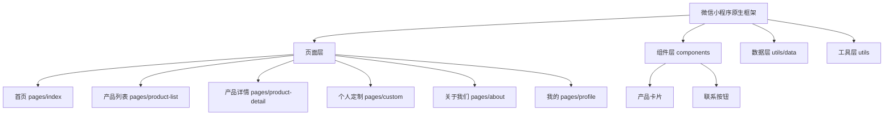

## 1. Architecture Design


## 2. Technology Description
- 框架: 微信小程序原生框架
- 语言: JavaScript + WXML + WXSS
- 单位: rpx 响应式像素
- 微信能力: 授权登录、地图、拨打电话、导航等

## 3. Page Definitions
| 页面路径 | 页面名称 | TabBar |
|---------|---------|--------|
| pages/index/index | 首页 | 是 |
| pages/custom/custom | 个人定制 | 是 |
| pages/about/about | 关于我们 | 是 |
| pages/profile/profile | 我的 | 是 |
| pages/product-list/product-list | 产品列表 | 否 |
| pages/product-detail/product-detail | 产品详情 | 否 |

## 4. Data Model

### 4.1 Data Structure
```javascript
// 产品数据
const products = [
  {
    id: '1',
    name: '海南黄花梨鬼脸对牌',
    price: 148,
    images: ['image1.jpg', 'image2.jpg'],
    category: 'wood',
    orders: 0,
    description: '精选上等天然材质...'
  }
];

// 分类数据
const categories = [
  { id: 'all', name: '全部' },
  { id: 'jade', name: '玉石类' },
  { id: 'wood', name: '木制类' },
  { id: 'gem', name: '宝石类' },
  { id: 'nut', name: '果核类' }
];

// 购物车项
interface CartItem {
  productId: string;
  productName: string;
  price: number;
  image: string;
  quantity: number;
}

// 定制订单
interface CustomOrder {
  id: string;
  name: string;
  phone: string;
  material: string;
  purpose: string;
  message?: string;
  createdAt: string;
}

// 用户信息
interface UserInfo {
  nickName: string;
  avatarUrl: string;
  phone?: string;
}
```

## 5. Project Structure
```
/workspace
├── app.js
├── app.json
├── app.wxss
├── sitemap.json
├── project.config.json
├── pages/
│   ├── index/
│   │   ├── index.js
│   │   ├── index.json
│   │   ├── index.wxml
│   │   └── index.wxss
│   ├── product-list/
│   │   ├── product-list.js
│   │   ├── product-list.json
│   │   ├── product-list.wxml
│   │   └── product-list.wxss
│   ├── product-detail/
│   │   ├── product-detail.js
│   │   ├── product-detail.json
│   │   ├── product-detail.wxml
│   │   └── product-detail.wxss
│   ├── custom/
│   │   ├── custom.js
│   │   ├── custom.json
│   │   ├── custom.wxml
│   │   └── custom.wxss
│   ├── about/
│   │   ├── about.js
│   │   ├── about.json
│   │   ├── about.wxml
│   │   └── about.wxss
│   └── profile/
│       ├── profile.js
│       ├── profile.json
│       ├── profile.wxml
│       └── profile.wxss
├── components/
│   ├── product-card/
│   │   ├── product-card.js
│   │   ├── product-card.json
│   │   ├── product-card.wxml
│   │   └── product-card.wxss
│   └── contact-buttons/
│       ├── contact-buttons.js
│       ├── contact-buttons.json
│       ├── contact-buttons.wxml
│       └── contact-buttons.wxss
├── utils/
│   ├── data.js
│   └── util.js
└── images/
```
