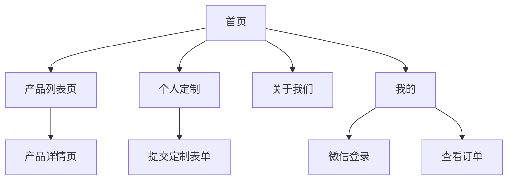

## 1. Product Overview
玉石订购微信小程序是一款面向玉石爱好者和收藏者的微信小程序应用，提供玉石产品浏览、购买、个人定制、在线咨询等功能。
- 解决玉石爱好者选购困难的问题，提供分类展示、搜索筛选和个性化定制服务
- 目标是成为玉石爱好者信赖的微信小程序购物平台

## 2. Core Features

### 2.1 User Roles
| Role | Registration Method | Core Permissions |
|------|---------------------|------------------|
| 用户 | 微信授权登录 | 浏览产品、搜索筛选、购买预订、提交定制、咨询客服、查看订单 |

### 2.2 Feature Module
1. **首页**: 轮播图、分类导航、产品推荐、保养知识
2. **产品列表页**: 搜索框、分类标签、产品网格、购物车入口
3. **产品详情页**: 产品大图、价格展示、详情介绍、立即预订
4. **个人定制**: 定制表单、材质选择、用途选择
5. **关于我们**: 品牌介绍、门店展示、联系方式
6. **我的**: 用户登录、订单查看、个人信息、客服咨询

### 2.3 Page Details
| Page Name | Module Name | Feature description |
|-----------|-------------|---------------------|
| 首页 | 轮播图 | 展示玉石产品和品牌形象，自动轮播 |
| 首页 | 分类导航 | 玉石类、木制类、宝石类、果核类等分类快速入口 |
| 首页 | 产品推荐 | 新品上架展示，点击进入产品列表 |
| 首页 | 保养知识 | 玉石保养小贴士，语音播放功能 |
| 产品列表页 | 搜索框 | 输入商品名称搜索 |
| 产品列表页 | 分类标签 | 全部、玉石类、木制类等标签切换 |
| 产品列表页 | 产品网格 | 产品图片、名称、价格、购物车按钮 |
| 产品列表页 | 购物车 | 悬浮购物车图标 |
| 产品详情页 | 产品轮播 | 多图轮播展示 |
| 产品详情页 | 价格信息 | 价格、已预订数量 |
| 产品详情页 | 详情描述 | 产品介绍、服务详情 |
| 产品详情页 | 预订按钮 | 立即预订、电话咨询 |
| 个人定制 | 定制表单 | 用户填写姓名、电话、选择材质和用途 |
| 个人定制 | 材质选择 | 提供玉石类、木制类、宝石类、果核类等选项 |
| 个人定制 | 用途选择 | 个人佩戴、收藏、礼赠等选项 |
| 关于我们 | 品牌介绍 | 展示品牌历史和特色 |
| 关于我们 | 门店展示 | 地图定位，显示线下门店位置 |
| 我的 | 用户登录 | 微信一键登录，展示用户信息 |
| 我的 | 订单管理 | 待支付、进行中、已完成、已取消订单查看 |
| 我的 | 客服咨询 | 悬浮电话和微信咨询按钮 |

## 3. Core Process
用户打开小程序，首先浏览首页的玉石产品，点击进入产品列表页，可搜索和筛选产品，点击产品进入详情页，可立即预订。如果有特殊需求，可以进入个人定制页面提交定制申请。用户可以查看关于我们了解品牌和门店信息。登录后可以在"我的"页面查看订单状态和管理个人信息。

## 4. User Interface Design
### 4.1 Design Style
- 主色调：深金色、米色、棕色系，营造高端奢华感
- 辅助色：红色点缀，增加活力
- 按钮风格：圆角矩形，优雅简洁
- 字体：系统字体，优雅的中文显示
- 布局风格：卡片式布局，清新自然
- 图标风格：简约线性图标，与整体风格协调

### 4.2 Page Design Overview
| Page Name | Module Name | UI Elements |
|-----------|-------------|-------------|
| 首页 | 轮播图 | 全屏宽度，圆角设计，自动轮播动画 |
| 首页 | 分类导航 | 圆形图标 + 文字，横向滚动 |
| 首页 | 产品卡片 | 图片 + 名称 + 价格 + 预订数，网格布局 |
| 产品列表页 | 搜索框 | 顶部搜索，圆角设计 |
| 产品列表页 | 分类标签 | 横向滚动标签，选中高亮 |
| 产品列表页 | 产品网格 | 两列布局，每个产品带购物车按钮 |
| 产品详情页 | 轮播图 | 产品多图轮播 |
| 产品详情页 | 信息区 | 产品名称、价格、已预订数 |
| 产品详情页 | 底部操作栏 | 电话按钮、立即预订按钮 |
| 个人定制 | 表单 | 输入框、单选按钮，清晰的标签 |
| 我的 | 用户中心 | 头像、用户名、订单状态图标 |

### 4.3 Responsiveness
微信小程序标准设计，rpx单位适配，底部导航栏，顶部标题栏。
